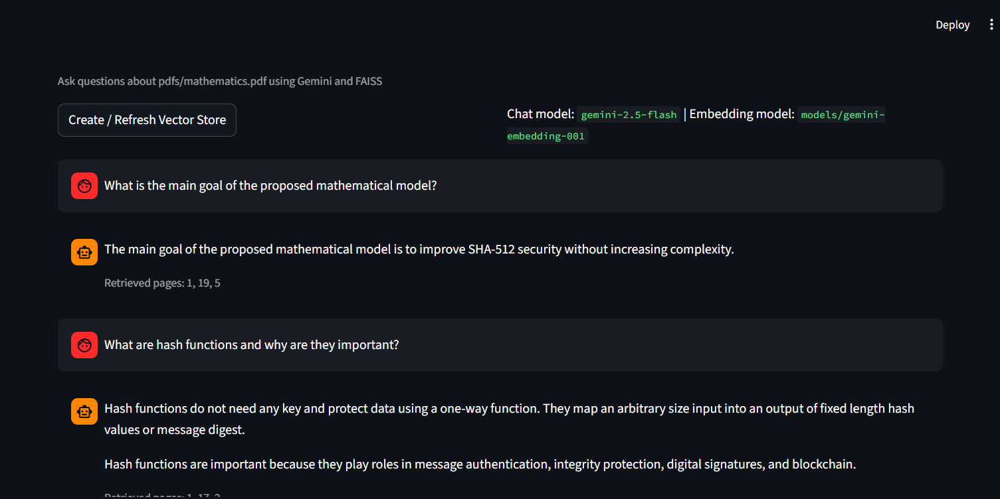

# AI RAG System

A Retrieval-Augmented Generation (RAG) chatbot for a mathematics PDF using Gemini models, FAISS vector search, LangChain orchestration, and a Streamlit chat UI.



## System Overview

This system answers user questions from a local PDF by combining semantic retrieval with a constrained LLM prompt.

1. PDF ingestion

- The PDF is loaded from `pdfs/mathematics.pdf`.

2. Chunking

- Text is split with `RecursiveCharacterTextSplitter`.
- Current settings: `chunk_size=1000`, `chunk_overlap=150`.

3. Embedding + indexing

- Chunks are embedded with `models/gemini-embedding-001`.
- Vectors are indexed and saved to `vectorstores/mathematics_faiss_gemini` using FAISS.

4. Retrieval

- For each question, the retriever returns top-k chunks (`k=4`).

5. Answer generation

- `gemini-2.5-flash` receives retrieved context plus the user question.
- Prompt instructs the model to answer only from retrieved context.

6. UI

- Streamlit provides chat interaction and a button to create/refresh the vector store.

## Key Features

- Local PDF-to-chat workflow.
- Persistent FAISS index for faster reuse.
- Source-page display from retrieved chunks.
- Streamlit interface with session message history.
- Optional sidebar API key override.

## Project Structure

```text
rag_chatbot/
├─ app.py
├─ rag_notebook.ipynb
├─ requirements.txt
├─ README.md
├─ images/
│  └─ dashboard.png
├─ pdfs/
│  └─ mathematics.pdf
└─ vectorstores/
   └─ mathematics_faiss_gemini/
```

## Tech Stack

- Python
- Streamlit
- LangChain
- FAISS (`faiss-cpu`)
- Google Gemini (`langchain-google-genai`)
- PyPDF (`pypdf` / `PyPDFLoader`)

## Prerequisites

- Python 3.10+
- A valid `GOOGLE_API_KEY`

## Setup

1. Create and activate a virtual environment.
2. Install dependencies:

```bash
pip install -r requirements.txt
```

3. Create `.env` in the project root:

```env
GOOGLE_API_KEY=your_api_key_here
```

## Run

Start the Streamlit app:

```bash
streamlit run app.py
```

Open the local URL shown in terminal (usually `http://localhost:8501`).

## Configuration

You can tune behavior in `app.py`:

- `EMBEDDING_MODEL = "models/gemini-embedding-001"`
- `CHAT_MODEL = "gemini-2.5-flash"`
- `CHUNK_SIZE = 1000`
- `CHUNK_OVERLAP = 150`
- Retriever `k` in `search_kwargs={"k": 4}`

## Known Limitations

- Retrieval is dense-only (no hybrid keyword retrieval yet).
- Chunking is fixed-size oriented, not true semantic chunking.
- No automated RAG evaluation harness yet.
- Basic observability and cost controls.

## Improvement Dashboard

| Area              | Current State                 | Target State                               | Priority | Status  |
| ----------------- | ----------------------------- | ------------------------------------------ | -------- | ------- |
| Retrieval Quality | Top-k dense retrieval (`k=4`) | Hybrid retrieval + reranking               | High     | Planned |
| Chunking Strategy | Fixed-size chunking           | Semantic / hierarchical chunking           | High     | Planned |
| Evaluation        | Manual checks                 | Automated RAG evaluation                   | High     | Planned |
| Prompting         | Single static template        | Prompt variants + guardrails               | Medium   | Planned |
| Observability     | Minimal app logs              | Latency and retrieval-quality metrics      | Medium   | Planned |
| UX                | Basic chat flow               | Better citations and filtering controls    | Medium   | Planned |
| Security          | Env/sidebar key entry         | Managed secrets + safer deployment pattern | High     | Planned |

## Improvement Plan (Practical)

### Phase 1: Quality Baseline

- Create a small benchmark dataset (`question`, `expected answer`, `source page`).
- Track baseline metrics: grounded-answer rate, citation accuracy, latency.
- Tune `k`, `chunk_size`, and `chunk_overlap` with A/B runs.

### Phase 2: Retrieval Upgrades

- Add MMR or reranking to reduce duplicate and noisy chunks.
- Add metadata-aware retrieval (sections/pages/topics).
- Evaluate hybrid retrieval (dense + BM25).

### Phase 3: Reliability and Ops

- Add structured logs and request tracing.
- Add retries/timeouts for model and embedding calls.
- Add regression checks in CI for retrieval and answer quality.

## Success Criteria

- Grounded-answer rate >= 90% on evaluation set.
- Citation accuracy >= 95%.
- Median response latency <= 3 seconds for common questions.
- Hallucination reports trend downward over time.

## Troubleshooting

- `GOOGLE_API_KEY` missing:
  - Set key in `.env` or enter in Streamlit sidebar.

- PDF not found:
  - Ensure file exists at `pdfs/mathematics.pdf`.

- Empty or weak answers:
  - Rebuild vector store and increase retriever `k`.
  - Revisit chunk settings.
